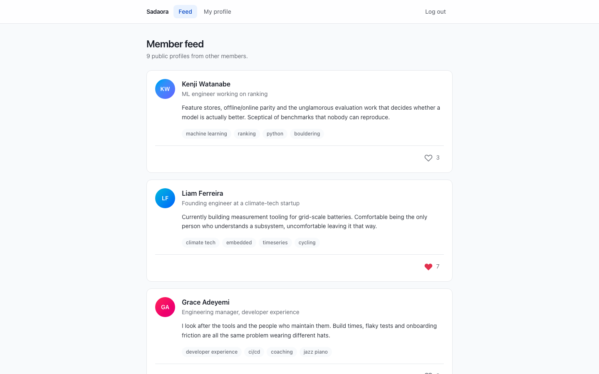
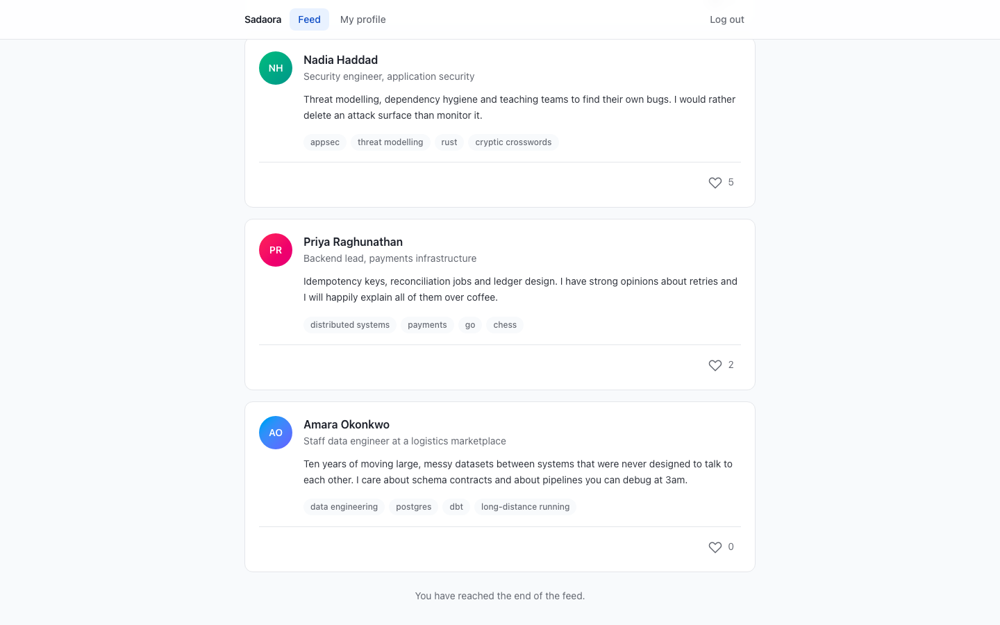
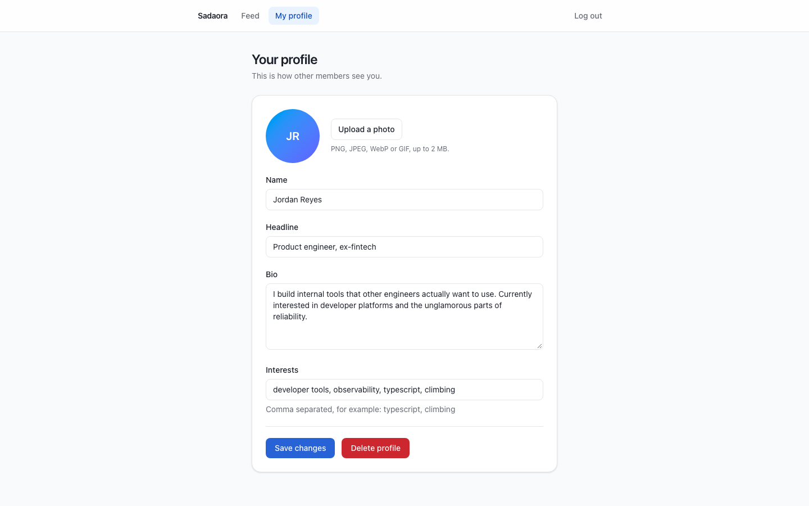
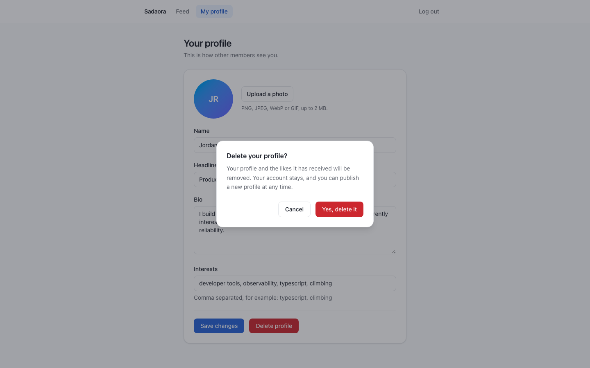
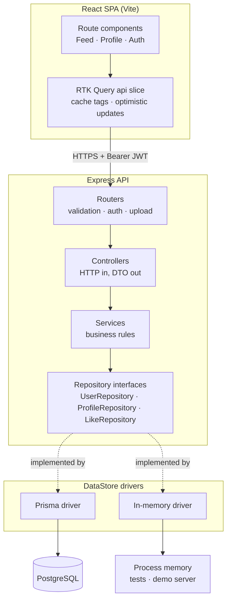
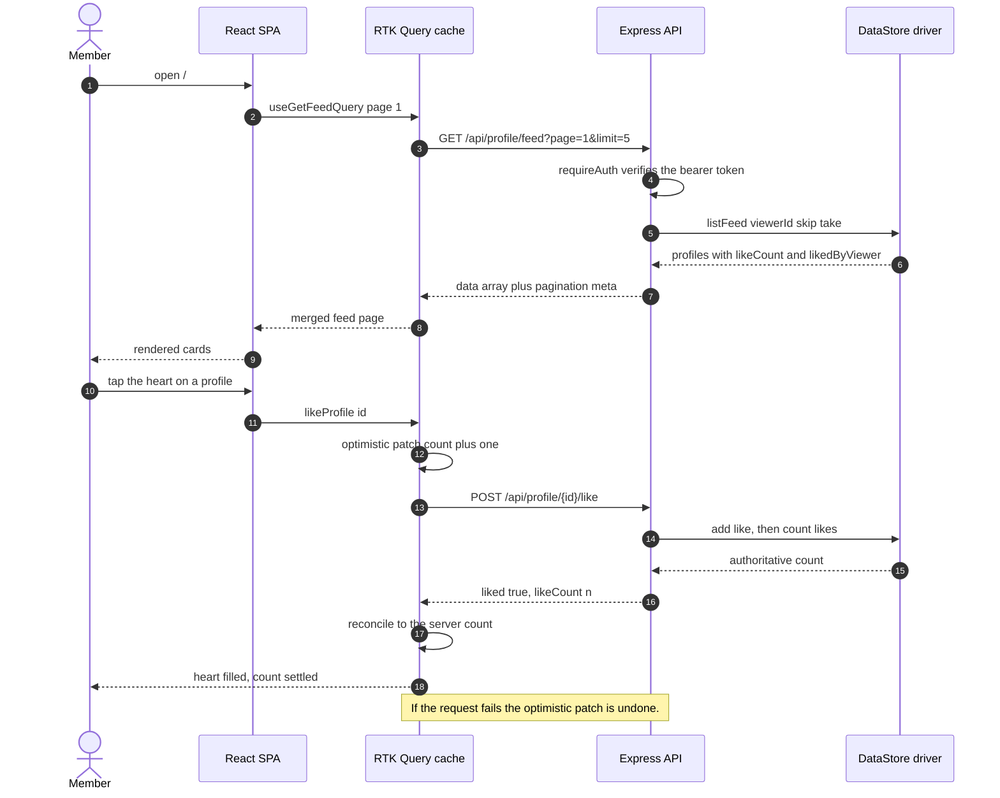

# Sadaora — member profiles and public feed

A small full-stack application built as a take-home assessment for Sadaora. A member
signs up, writes a single public profile (name, headline, bio, interests, optional photo)
and browses a paginated feed of every other member's profile, liking and unliking as they
go. The API is Express + Prisma over PostgreSQL; the client is React 19 with Redux Toolkit
Query.

This repository is an **assessment submission**, so it stays deliberately narrow: no AI
features and no new product surface have been added. The work here is correctness,
architecture, tests, accessibility and documentation.

---

## Screenshots

Captured at 1440×900 against the application running locally, signed in as the seeded demo
account. Every figure below is a real screen with real seeded data — nothing is mocked up.

| Member feed | Feed after "Load more" |
| --- | --- |
|  |  |

| Profile editor | Delete confirmation |
| --- | --- |
|  |  |

---

## Architecture



Dependencies point inward. Controllers know about HTTP and nothing about Prisma; services
know about business rules and nothing about HTTP; the storage engine sits behind three
interfaces that the services depend on. That inversion is what makes the whole HTTP
surface testable without a database.

## Main flow — viewing the feed and liking a profile



---

## Quickstart

The fastest way to see the application running, with realistic content and **no database
to install**:

```bash
# terminal 1 — API with the in-memory driver, pre-seeded
cd backend && npm install && npm run demo

# terminal 2 — the SPA
cd frontend && npm install && npm run dev
```

Open <http://localhost:5173> and sign in as `demo@sadaora.test` / `sadaora-demo-2025`.

### Running against PostgreSQL

```bash
cd backend
cp .env.sample .env          # then set DATABASE_URL and JWT_SECRET
npx prisma migrate deploy    # apply the committed migrations
npm run dev                  # http://localhost:3001
```

```bash
cd frontend
cp .env.example .env         # VITE_API_URL, if the API is not on :3001
npm run dev                  # http://localhost:5173
```

### With Docker

```bash
cp .env.example .env         # set JWT_SECRET; compose refuses to start without it
docker compose up --build
```

The web container serves the built SPA on <http://localhost:8080> and the API listens on
<http://localhost:3001>. Migrations are applied on API start.

---

## Configuration

### Backend (`backend/.env`)

| Variable | Required | Default | Purpose |
| --- | --- | --- | --- |
| `DATABASE_URL` | When `DATA_DRIVER=prisma` | — | PostgreSQL connection string used by Prisma. |
| `JWT_SECRET` | Yes in production | `dev-only-insecure-secret` outside production | Signing key for access tokens. Boot fails if it is unset when `NODE_ENV=production`. |
| `JWT_EXPIRES_IN` | No | `7d` | Access-token lifetime. |
| `PORT` | No | `3001` | Port the API listens on. |
| `NODE_ENV` | No | `development` | `production` tightens the `JWT_SECRET` rule; `test` silences the logger. |
| `CORS_ORIGIN` | No | `http://localhost:5173` | Comma-separated list of origins allowed to call the API. |
| `DATA_DRIVER` | No | `prisma` | `prisma` (PostgreSQL) or `memory` (in-process, no database). |
| `UPLOAD_DIR` | No | `backend/uploads` | Where profile photos are written and served from. |
| `MAX_UPLOAD_BYTES` | No | `2097152` (2 MB) | Largest accepted profile photo. |
| `FEED_PAGE_SIZE` | No | `5` | Default page size for the feed. |
| `MAX_FEED_PAGE_SIZE` | No | `50` | Ceiling applied to a client-supplied `limit`. |
| `BCRYPT_ROUNDS` | No | `10` | Password hashing cost. |

### Frontend (`frontend/.env`)

| Variable | Required | Default | Purpose |
| --- | --- | --- | --- |
| `VITE_API_URL` | No | `http://localhost:3001/api` | Base URL of the API, including the `/api` prefix. Inlined at build time. |

### Docker Compose (`./.env`)

| Variable | Required | Default | Purpose |
| --- | --- | --- | --- |
| `JWT_SECRET` | **Yes** | — | Compose fails fast if unset. |
| `POSTGRES_USER` / `POSTGRES_PASSWORD` / `POSTGRES_DB` | No | `sadaora` | Credentials for the bundled database. |
| `API_PORT` | No | `3001` | Host port mapped to the API. |
| `WEB_PORT` | No | `8080` | Host port mapped to the SPA. |
| `VITE_API_URL` | No | `http://localhost:3001/api` | Baked into the SPA bundle at image build time. |
| `CORS_ORIGIN` | No | `http://localhost:8080` | Origin the API will accept. |

---

## Development

```bash
# Backend
cd backend
npm run dev          # ts-node + nodemon, watches src/
npm run demo         # seeded in-memory API, no database needed
npm test             # Jest: unit + supertest integration
npm run test:coverage
npm run lint         # ESLint (airbnb-typescript)
npm run typecheck    # tsc --noEmit over src, tests and scripts
npm run build        # tsc -p tsconfig.build.json -> dist/

# Frontend
cd frontend
npm run dev
npm test             # Vitest + Testing Library, network intercepted by MSW
npm run test:coverage
npm run lint
npm run typecheck
npm run build        # tsc -b && vite build
```

Neither suite touches a network or a database. The backend integration tests run the real
Express app over the in-memory driver; the frontend tests intercept every request with MSW
and fail the run on any request that has no handler.

### Project structure

```
backend/
  prisma/
    schema.prisma              # User, Profile, Like; indexes and cascade rules
    migrations/                # committed SQL, applied with `prisma migrate deploy`
  scripts/
    seed.ts                    # realistic demo content, driver-agnostic
    demo-server.ts             # boots the real API on the in-memory driver
  src/
    app.ts                     # composition root: builds the object graph
    server.ts                  # binds the port, handles SIGTERM
    config/env.ts              # the only module that reads process.env
    routes/                    # routers + express-validator rules
    controllers/               # request -> service -> DTO, nothing else
    services/                  # business rules, framework-free
    repositories/
      types.ts                 # the persistence contracts
      prisma/                  # PostgreSQL driver
      memory/                  # in-process driver (tests, demo)
    dto/                       # response shaping, incl. absolute photo URLs
    middleware/                # auth, validation, upload, error handling
    lib/                       # tokens, passwords, async handler, HttpError
  tests/
    unit/                      # services, DTOs, tokens, Prisma query shapes
    integration/               # supertest against the real app
frontend/
  src/
    app/                       # Redux store and typed hooks
    services/                  # RTK Query api slice and response types
    features/
      auth/                    # login and signup, sharing one form component
      feed/                    # feed page and profile card
      profile/                 # profile editor and confirmation dialog
    components/ui/             # Button, Field, Avatar, state components
    lib/                       # token storage, error normalisation, initials
    test/                      # MSW handlers, fixtures, render helper
docs/screenshots/              # the images above
```

---

## Design notes

**Layering.** The original submission put Prisma calls, bcrypt, JWT signing and HTTP
response shaping in the same controller functions, with a `new PrismaClient()` per module.
Responsibilities are now split: routers validate, controllers translate, services decide,
repositories persist. Services depend on three interfaces (`UserRepository`,
`ProfileRepository`, `LikeRepository`) rather than on Prisma, and `createApp()` is the
single place the graph is wired.

**The extension seam.** That interface boundary is the one seam worth having here, and it
pays for itself immediately: the same `DataStore` contract has two implementations. The
Prisma driver is production; the in-memory driver powers the integration tests and the
`npm run demo` server. Adding a third (a read replica, a cache-through layer, SQLite for
local work) is a new folder under `repositories/` and one line in the driver registry, with
no change to any service.

**Scalability — the real bottleneck.** It was the feed, in two places.

1. The feed loaded every `Like` row for every profile on the page (`include: { likes: true }`)
   purely to call `.length` on the array in JavaScript, and shipped those rows to the client.
   A profile with 50 000 likes meant 50 000 rows crossing the wire per feed card. It now uses
   `_count` so PostgreSQL aggregates, plus one bounded sub-select (`take: 1`) for "did *I*
   like this". Payload per card is now constant rather than proportional to popularity.
2. `Like` had no index on `profileId` or `likedById` and no unique constraint, and `Profile`
   had no index on `createdAt` despite every feed page sorting by it. The committed migration
   adds all four.

Pagination was also unbounded in the sense that a client could ask for any `limit`; it is
now clamped to `MAX_FEED_PAGE_SIZE`, and the response carries real `total`/`hasMore` metadata
instead of the client inferring "there is more" from a page length compared against a
hardcoded 5.

**Concurrency.** Liking was a read-then-write (`findFirst`, then `create`), which two
concurrent requests could both pass. The unique index `(profileId, likedById)` is now the
source of truth and the repository treats the unique violation as "already liked". Saving a
profile was likewise find-then-create-or-update; it is a single `upsert`.

**Error handling.** Express 4 does not await async handlers, so any rejected promise in the
original escaped the router and the request hung until the client timed out — which is
exactly what happened when deleting a profile that had likes. Every async handler is now
wrapped, and one error middleware turns an `HttpError` into `{ error: { code, message,
details } }` while collapsing anything unrecognised into a generic 500, so driver messages
and file paths never reach a client.

**Client cache.** The feed used to be copied out of RTK Query into component state and
appended to on every change, which duplicated rows. It now uses a single cache entry with a
`merge` function, so "Load more" is a cache concern rather than a state-management one.
Likes are optimistic but reconcile against the count the server returns, so the displayed
number cannot drift.

**Uploads.** The stored filename is now a UUID plus an extension derived from the validated
MIME type. Previously the extension came from the uploaded filename, so `payload.html`
landed in a directory served by `express.static` — a stored-XSS vector. Size and type are
both enforced.

**Bundle.** The production build is 20.8 kB of application code (6.9 kB gzipped) plus a
293.9 kB vendor chunk (95.6 kB gzipped), split so an application change does not invalidate
the cached vendor bundle. Measured with `npm run build`.

**Dependency change.** Password hashing moved from `bcrypt` to `bcryptjs`. The native
`bcrypt` binding fails to build on Node 22 in a clean environment, which broke
`npm install && npm test` outright; `bcryptjs` is a drop-in with the same hash format and
removes the need for a C toolchain in the Docker image. No framework major versions were
changed.

---

## Limitations

- **Profile photos are stored on the API's local disk** and served by Express. That does not
  survive a redeploy and does not work behind more than one API instance. Object storage
  (S3 or similar) behind the existing `photoUrl` field is the obvious next step; the DTO
  layer already passes through absolute URLs unchanged, so a CDN URL needs no code change.
- **No refresh tokens.** A single access token is stored in `localStorage`, which is
  readable by any script on the origin. An httpOnly refresh cookie with short-lived access
  tokens would be the production answer; it was out of scope for the brief.
- **Offset pagination.** `skip`/`take` degrades on very deep pages and can skip or repeat a
  row if profiles are created while a member is paging. Keyset pagination on
  `(createdAt, id)` would fix both; the index needed for it is already in place.
- **The feed is not personalised or searchable** — it is every other member, newest first.
  No search, filtering by interest, or ranking.
- **Rate limiting and account recovery are absent.** There is nothing to slow down credential
  stuffing against `/api/auth/login`, and no password reset flow.
- **The in-memory driver is for tests and the demo only.** It is not durable, not shared
  between processes, and its `listFeed` sorts in JavaScript.
- **The Docker images are authored but unbuilt.** `docker compose config` parses cleanly;
  the images have not been built or booted in this environment.
- **Migrations are committed but unapplied here.** No PostgreSQL server was available, so the
  index/cascade migration was verified by diffing it against Prisma's own generated DDL
  (`prisma migrate diff --from-empty`) rather than by running it.
