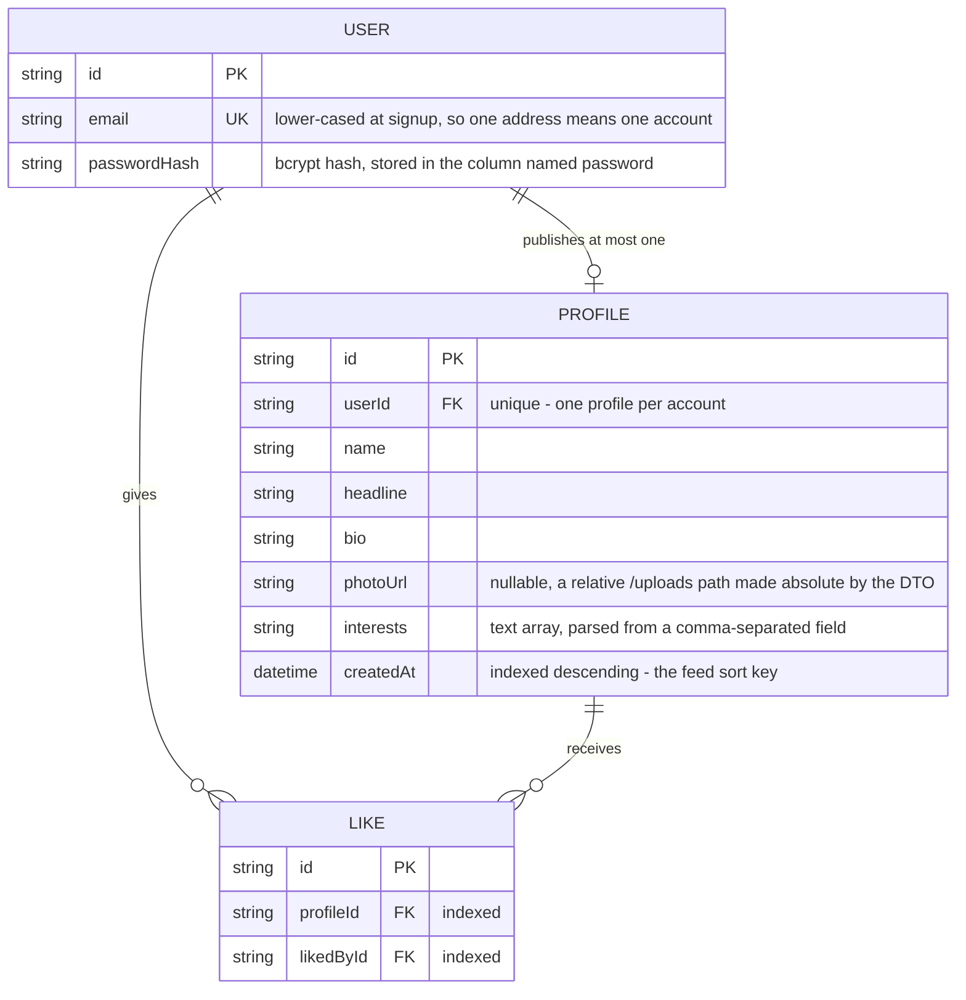
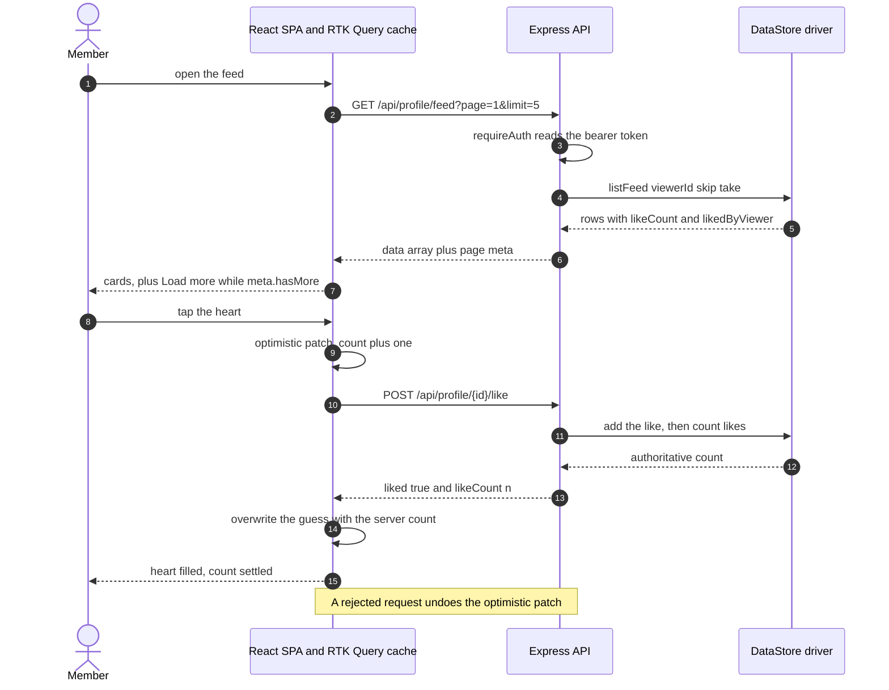

# Sadaora — one profile each, one public feed

A small full-stack app: you sign up, publish a single public profile (name, headline, bio,
comma-separated interests, optional photo), and page through every other member's profile,
liking and unliking as you go. Express + Prisma over PostgreSQL behind a React 19 SPA that
does all of its data access through RTK Query.

It was built as a take-home assessment, so the scope stays fixed to that brief — no extra
product surface. The work that *is* here is correctness, layering, tests and documentation.

## Try it without installing a database

The API ships with a second storage driver that lives in process memory, pre-seeded with ten
members. It runs the real routes, middleware, validation and services — only the repository
implementation differs — and it is how the screenshots below were captured.

```bash
# terminal 1 — API on :3001, in-memory, seeded
cd backend && npm install && npm run demo

# terminal 2 — the SPA on :5173
cd frontend && npm install && npm run dev
```

Sign in at <http://localhost:5173> as `demo@sadaora.test` / `sadaora-demo-2025`.

<details>
<summary>Against a real PostgreSQL, or in Docker</summary>

```bash
cd backend
cp .env.sample .env          # set DATABASE_URL and JWT_SECRET
npx prisma migrate deploy    # apply the committed migrations
npm run dev                  # http://localhost:3001, then `npm run dev` in frontend/
```

Or the whole stack — Postgres, the API on :3001, nginx serving the built SPA on :8080 — with
the API gated on the database healthcheck and running `prisma migrate deploy` before it
boots:

```bash
cp .env.example .env         # JWT_SECRET is mandatory — compose refuses to start without it
docker compose up --build
```

**These images have not been built or booted here.** `docker compose config` parses and
resolves cleanly, and that is the extent of the verification.
</details>

## What it looks like

| | |
| --- | --- |
|  |  |
| Feed, top of page one | After "Load more" — end of the feed |
|  |  |
| The profile editor | Deleting a profile |

All four are 1440×900, taken against the seeded demo API described above.

## The data it keeps

Three tables. The interesting parts are not the columns but the constraints — most of the
feed's behaviour is enforced by the database rather than by application code.



`@@unique([profileId, likedById])` is what makes a like idempotent: the repository inserts and
treats Prisma's `P2002` unique violation as "already liked", rather than doing a
read-then-write check that two concurrent requests could both pass. Both foreign keys cascade
on delete, and removing a profile clears its likes in the same transaction, so the behaviour
is identical whichever driver is in use.

The feed never counts likes in JavaScript. `listFeed` asks Postgres for
`_count: { select: { likes: true } }` and a single `take: 1` sub-select for "did *this*
viewer like it", so the payload per card is constant rather than proportional to how popular
the profile is.

## What happens when you like a profile



The whole paginated feed is one RTK Query cache entry with a `merge` function, so "Load more"
is a cache concern and never a second copy of the list in component state.

## The HTTP surface

Everything under `/api/profile` requires `Authorization: Bearer <token>`.

| Method | Path | Notes |
| --- | --- | --- |
| `POST` | `/api/auth/signup` | 409 if the email is taken. Emails are normalised first. |
| `POST` | `/api/auth/login` | One message and one code path for unknown email and wrong password. |
| `GET` | `/api/profile/me` | 404 when you have not published a profile yet. |
| `POST` | `/api/profile` | `multipart/form-data`, optional `photo`. Upsert, so it both creates and edits. |
| `DELETE` | `/api/profile` | 204. Removes the profile and its likes. Your account survives. |
| `GET` | `/api/profile/feed` | `?page=&limit=`. Excludes you. Returns `{ data, meta }`. |
| `POST` | `/api/profile/{id}/like` | Idempotent. 403 on your own profile, 404 on an unknown id. |
| `DELETE` | `/api/profile/{id}/like` | Idempotent. Returns the authoritative count. |
| `GET` | `/api/health` | No token. Reports the active data driver. |

Failures always come back as `{ error: { code, message, details? } }`. Anything the server
does not recognise is collapsed to a generic `INTERNAL_ERROR` 500, so Prisma messages and
file paths never reach a client. `401 INVALID_TOKEN` means the session is over and the SPA
signs you out; `403 FORBIDDEN` means you are signed in but not allowed to do this, and
deliberately does not.

## Where the code lives

```
backend/src/
  app.ts            composition root — builds the graph, binds no port
  server.ts         owns the port and the SIGTERM shutdown
  config/env.ts     the only module that reads process.env, validated at boot
  routes/           routers plus express-validator rules
  controllers/      HTTP in, DTO out, nothing else
  services/         business rules, framework-free
  repositories/     types.ts is the contract; prisma/ and memory/ implement it
  dto/              response shaping, including absolute photo URLs
  middleware/       auth, validation, upload, one error handler
backend/tests/      unit/ and integration/ (supertest against the real app)
backend/scripts/    seed.ts and demo-server.ts
frontend/src/
  services/api.ts   the single RTK Query slice
  features/         auth, feed, profile
  components/ui/    Button, Field, Avatar, loading and empty and error states
  lib/ · test/      token storage and error normalisation · MSW handlers and fixtures
```

`createApp({ store })` takes its data store as an argument, which is the hinge the rest of
the project hangs off: the integration tests, the demo server and production all boot the
same Express app and differ only in which `DataStore` they hand it. Services depend on
`UserRepository`, `ProfileRepository` and `LikeRepository` — never on Prisma — so adding a
driver is a folder under `repositories/` plus one line in the registry in
`repositories/index.ts`, with no change to any service, controller or route.

## Environment variables

`DATABASE_URL` is required when `DATA_DRIVER=prisma` (the default); `JWT_SECRET` is required
when `NODE_ENV=production` and otherwise falls back to an obviously-insecure dev value. The
rest are optional, with the defaults below:

| | |
| --- | --- |
| `PORT` `3001` | `NODE_ENV` `development` |
| `JWT_EXPIRES_IN` `7d` | `CORS_ORIGIN` `http://localhost:5173` (comma-separated) |
| `DATA_DRIVER` `prisma` | `UPLOAD_DIR` `backend/uploads` |
| `MAX_UPLOAD_BYTES` `2097152` | `BCRYPT_ROUNDS` `10` |
| `FEED_PAGE_SIZE` `5` | `MAX_FEED_PAGE_SIZE` `50` (ceiling on a client's `limit`) |

`backend/.env.sample` documents all of them. The SPA reads exactly one variable,
`VITE_API_URL` (default `http://localhost:3001/api`), inlined at build time. Compose reads a
mandatory `JWT_SECRET` plus `POSTGRES_USER` / `POSTGRES_PASSWORD` / `POSTGRES_DB`,
`API_PORT`, `WEB_PORT`, `VITE_API_URL` and `CORS_ORIGIN` — see `.env.example` at the root.

## Working on it

```bash
cd backend    # dev · demo · test · test:coverage · lint · typecheck · build
cd frontend   # dev · test · test:coverage · lint · typecheck · build
```

```
backend   Test Suites: 10 passed, 10 total     Tests:  73 passed, 73 total
frontend  Test Files    7 passed (7)           Tests:  44 passed (44)
```

Neither suite touches a network or a database. The backend integration tests drive the real
Express app over supertest on the in-memory driver; the unit tests cover the services, the
DTO mappers, token expiry, and the Prisma driver's *query shapes* against a mocked client —
so dropping the `_count` aggregate or unbounding the viewer sub-select fails a test. Jest
enforces coverage thresholds of 80/70/80/80. The frontend tests intercept every request with
MSW under `onUnhandledRequest: 'error'`, so a request with no handler fails the run.

`backend/tests/integration/regressions.test.ts` pins seven things that are cheap to break and
expensive to notice — among them: deleting a profile that has likes must answer rather than
hang, `/api/profile/feed` must not be swallowed by the `/:id` route pattern, and an internal
driver message must never reach a client.

## Decisions worth explaining

**Password hashing uses `bcryptjs`, not `bcrypt`.** Same hash format, pure JavaScript, no
native binding to compile — so `npm install` needs no C toolchain, on a developer's machine
or in the Docker image. `BCRYPT_ROUNDS` is configurable.

**Photo filenames are generated, never echoed.** The stored name is `photo-<uuid>` plus an
extension looked up from the validated MIME type, so nothing a client sends becomes a path
in the directory that `express.static` serves. Uploads are capped at 2 MB, one file, and
restricted to JPEG, PNG, WebP and GIF.

**The feed's page size is clamped** to `MAX_FEED_PAGE_SIZE`, because `limit` arrives from the
query string, and the response carries real `total`, `totalPages` and `hasMore` so the client
never infers "there is more" from a page length. Its DTO exposes `likeCount` and
`likedByCurrentUser` and nothing else — no `userId`, no array of like rows. Who liked whom is
not public data, and serialisation lives in one module so two endpoints cannot disagree about
the shape of `photoUrl`.

**The production bundle is 20.80 kB of app code (6.88 kB gzipped) plus a 293.90 kB vendor
chunk (95.58 kB gzipped)**, split so an app change does not invalidate the cached vendor
chunk. Measured with `npm run build`.

## Known gaps

- **Photos are written to the API's local disk** and served by Express. That does not survive
  a redeploy and does not work behind more than one instance. Object storage behind the
  existing `photoUrl` field is the obvious next step — the DTO layer passes absolute URLs
  through unchanged, so a CDN URL needs no code change.
- **No refresh tokens.** One access token in `localStorage`, readable by any script on the
  origin. Short-lived access tokens plus an httpOnly refresh cookie is the production answer.
- **Offset pagination** degrades on deep pages and can skip or repeat a row if profiles are
  created while you are paging. Keyset pagination on `(createdAt, id)` would fix both, and it
  would build on the descending `createdAt` index the feed already has.
- **No rate limiting on `/api/auth/login`** and no password reset flow.
- **The feed is not searchable, filterable or ranked** — it is every other member, newest
  first.
- **Nothing here has met a live PostgreSQL.** The Prisma driver's query shapes are asserted
  against a mock — which catches "we stopped aggregating in SQL" but not "this is invalid
  SQL" — and the index-and-cascade migration was checked by diffing it against Prisma's own
  generated DDL (`prisma migrate diff --from-empty`) rather than by applying it. The suite is
  driver-agnostic, so a CI job with a Postgres service container could close both gaps by
  rerunning the integration tests under `DATA_DRIVER=prisma`.
- **The in-memory driver is for tests and the demo only** — not durable, not shared between
  processes, and it sorts the feed in JavaScript.
